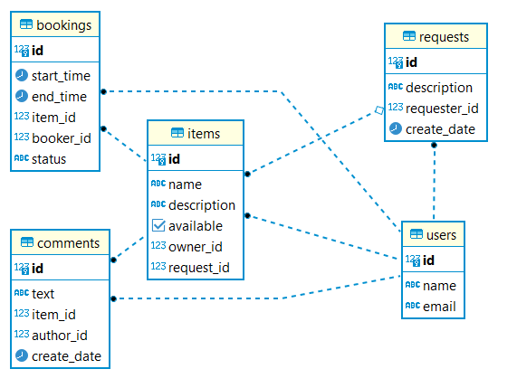

# java-shareit
Shareit lets users share items.

# Stack
- Java-11
- Spring Boot
- Spring Data JPA
- PostgreSQL / H2
- Maven
- Docker
- REST
- Lombok
- MockMVC

# Functionality
- The app consists of a server and a gateway. The gateway is reponsible for data validation;
- Adding, editing items; 
- Booking an item for a specified period of time;
- Blocking an item when it's already booked;
- Searching items;
- Posting requests for items if nothing suitable found;
- Adding items in response to a request;
- Getting all bookings for a users;
- Getting all items of a user;
- Posting comments on an item.

# ER Diagram

# Developer
[Olga Obraztsova](https://github.com/olgaobraztsova)

